### Este repositório contém o guia de montagem e as especificações técnicas da Caixa Mecânica com Engrenagens. O objetivo deste projeto é compreender o funcionamento de conjuntos mecânicos, analisando torque, encaixe e precisão dimensional.

## Integrantes:
Gabriel Diegues RM  
Luiza Cristina  RM99367  
Pedro Palladino RM551180

## 📏 Medidas das Peças

### 🔲 Caixinhas
| Peça | Comprimento | Altura |
|------|------------|--------|
| Caixinha 10Ω | 45 mm | 22,0 mm |
| Caixinha 100Ω | 45 mm | 22,0 mm |
| Caixinha 200Ω | 45 mm | 22,0 mm |
| Caixinha 1kΩ | 45 mm | 22,0 mm |
| Caixinha 10kΩ | 45 mm | 22,0 mm |
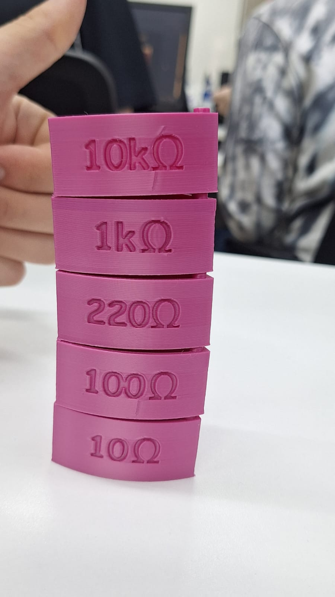
---

### ⚙️ Discos
| Peça | Diâmetro | Espessura |
|------|----------|-----------|
| Disco com desenho | 100,95 mm | 3,3 mm |
| Disco com pinos | 100,95 mm | 7,05 mm |
| Disco da base| 100,95 mm | 1,1 mm |
| Disco da base (com paredes) | - | 9,4 mm |

### Disco com Desenho

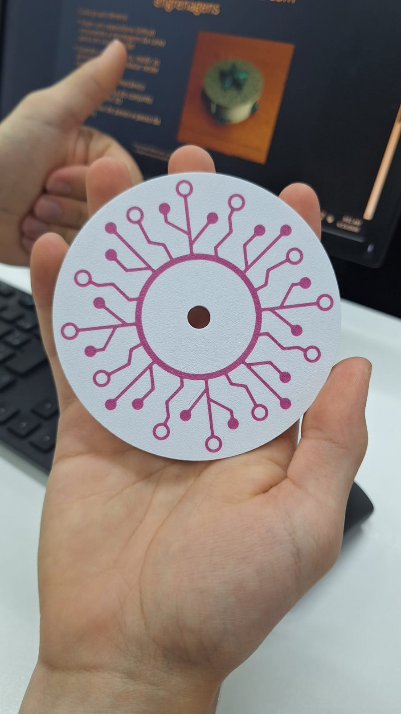 
---

### Disco com Pino

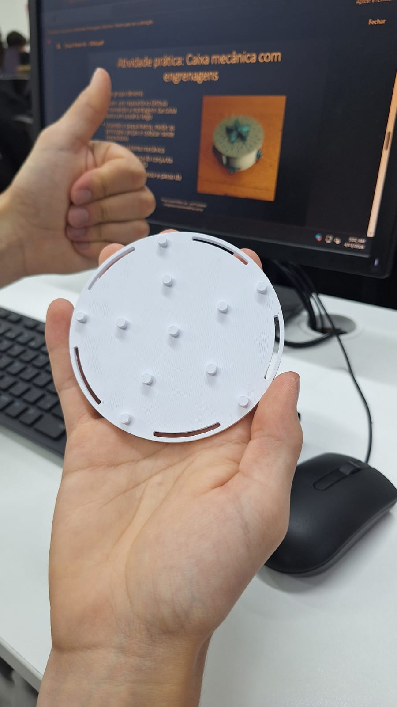
---
### Disco em cima das engrenagens

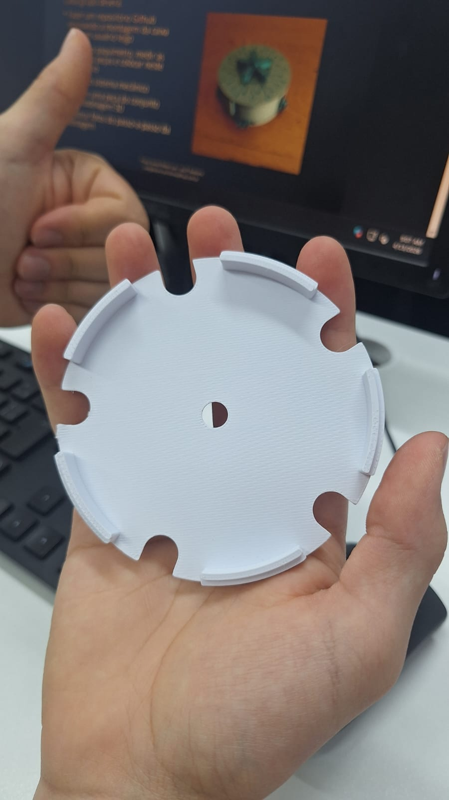
---

### ⭐ Estrelas
| Peça | Altura | Espessura |
|------|--------|-----------|
| Estrela menor | 38,35 mm | 10,65 mm |
| Estrela maior | 38,35 mm | 48,3 mm |

---

### Estrela Menor

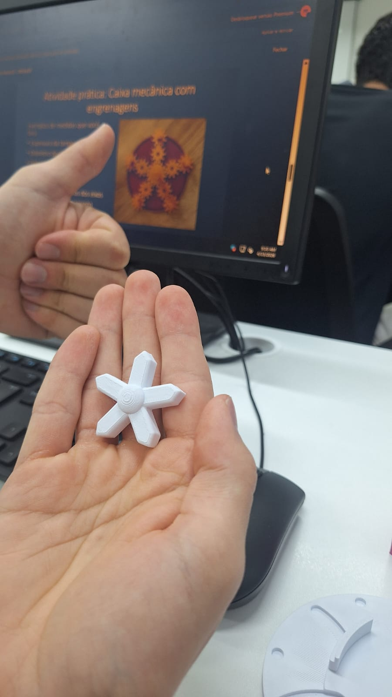
---
### Estrela Maior

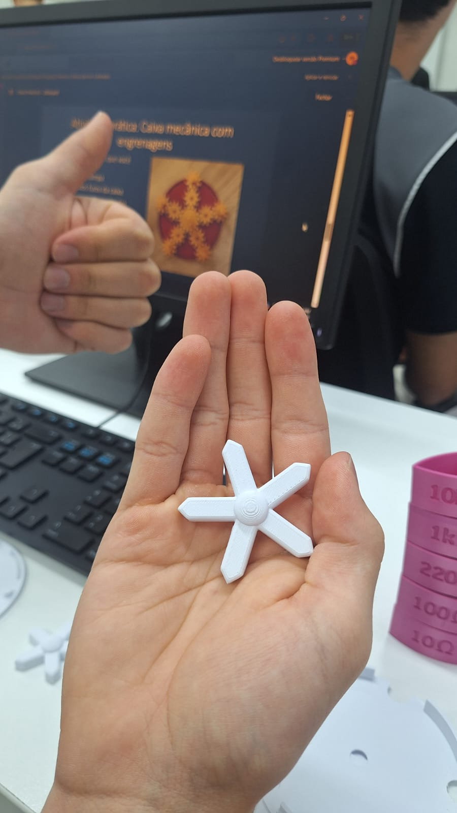
---

### ⚙️ Engrenagens
| Peça | Altura | Comprimento |
|------|--------|-------------|
| Engrenagem com pino | 40,25 mm (com pino) / 5,3 mm (sem pino) | 33,75 mm |
| Engrenagem com pino quadrado | 13 mm (com pino) / 5,1 mm (sem pino) | 23,55 mm |
| Engrenagem normal | 5,1 mm | 23,55 mm |

### Engrenagem com Pino

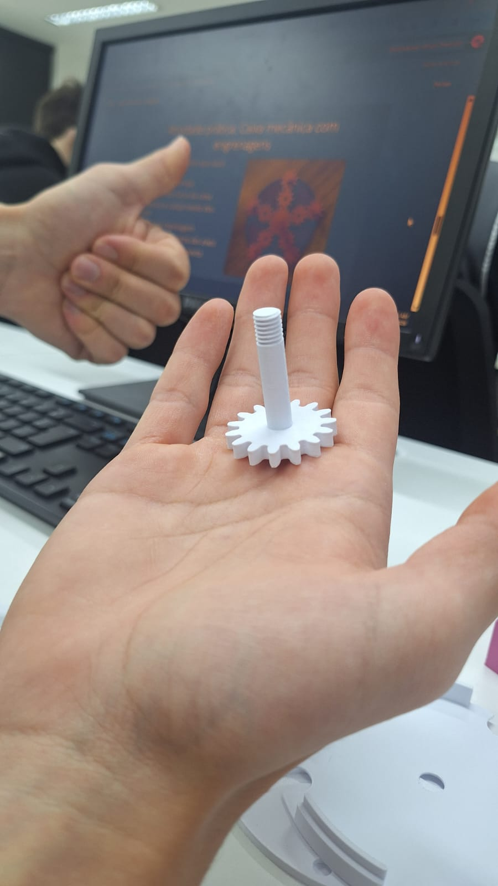
---
### Engrenagem com Pino Quadrado

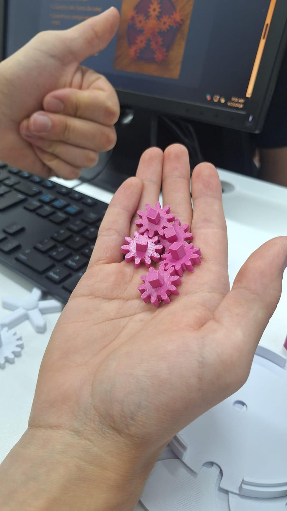
---

### Engrenagem com Pino Quadrado

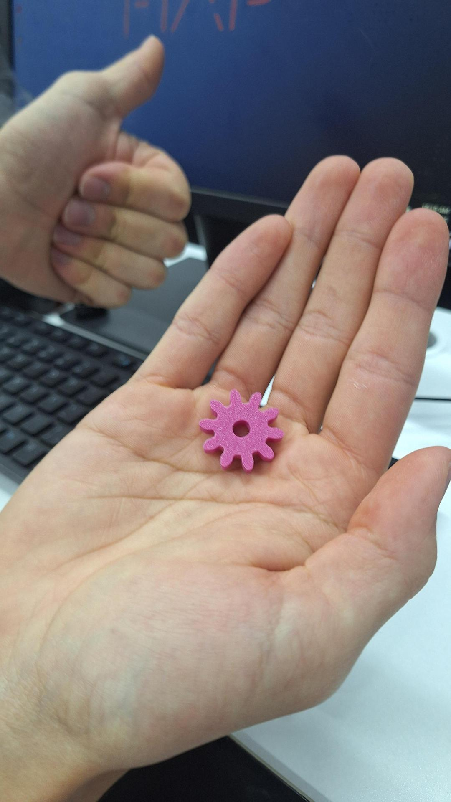
---
## 🛠️ Passo a Passo da Montagem

### 🔹 1. Separação e organização das peças

Neste primeiro passo, todas as peças foram separadas e organizadas para facilitar a montagem do sistema.

Pegar o disco com os pinos e colocar a engrenagem com o pino no centro, as engrenagens comum no meio e as com pino quadrado nas pontas. Finalizar com o disco em cima das engrenagens.

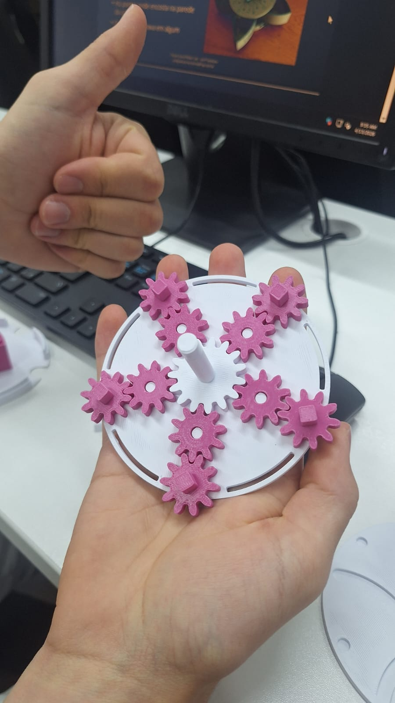
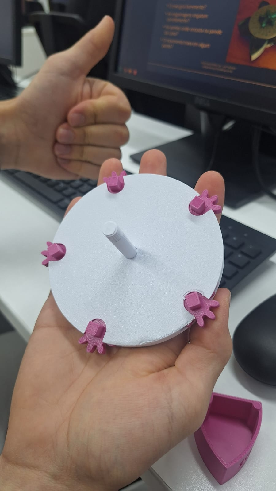

### 🔹Passo 2.

Colocar cada caxinha em cada engrenagem de pinos, em ordem: 10Ω, 100Ω, 200Ω, 1kΩ e 10kΩ.

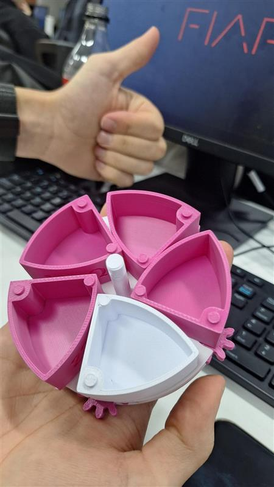
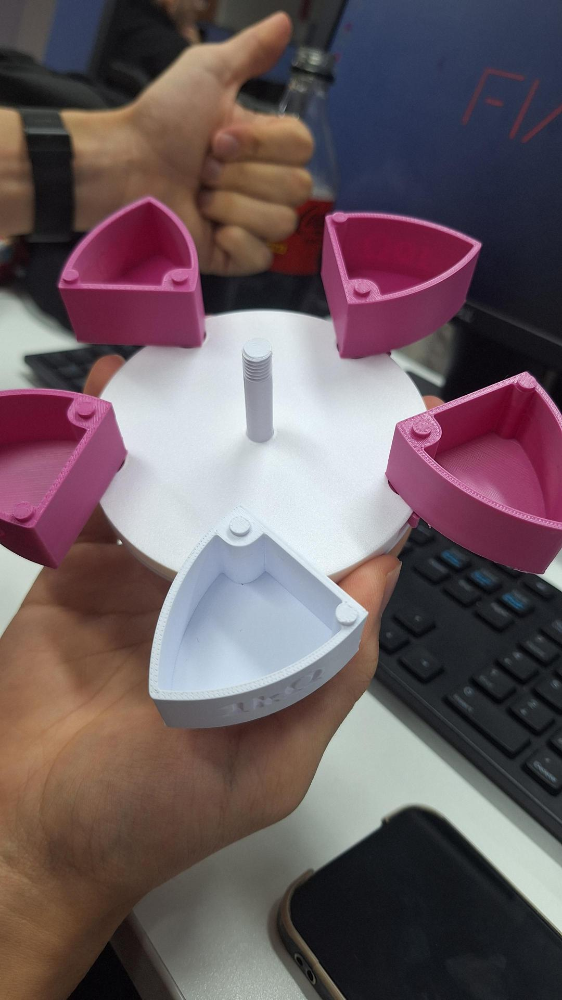
---

### 🔹Passo 3.

Fechar com o disco de desenho e colocar a estrela (maior ou menor) rosqueando no parafuso. 

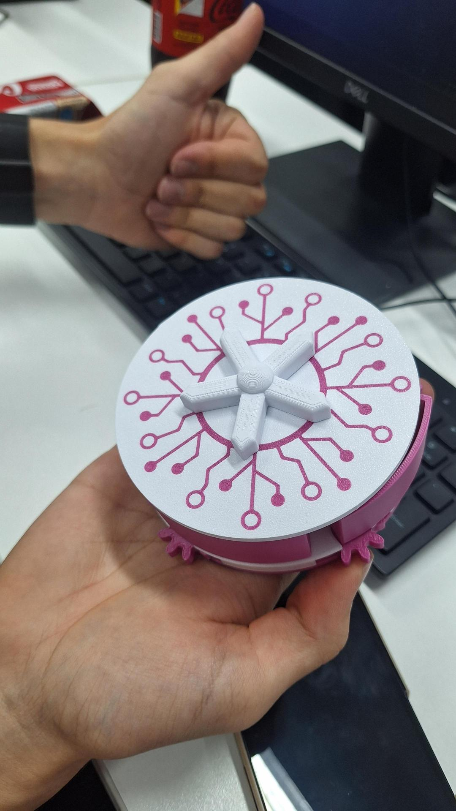

